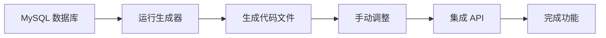

# 🚀 使用指南

## 方式一：直接配置运行（推荐）

### 1. 安装依赖

```bash
cd scripts
npm install
```

### 2. 编辑配置

打开 `generate-route-from-db.js`，修改顶部的配置：

```javascript
const DB_CONFIG = {
  host: 'localhost',
  user: 'root',
  password: 'your_password',  // 修改为你的密码
  database: 'your_database',  // 修改为你的数据库名
  port: 3306,
}

const TABLE_NAME = 'users'  // 修改为你的表名
```

### 3. 运行生成器

```bash
node generate-route-from-db.js
```

## 方式二：交互式运行

### 1. 运行交互式脚本

```bash
node generate-interactive.js
```

### 2. 按提示输入信息

脚本会引导你输入：
- 数据库连接信息
- 选择要生成的表
- 确认生成配置

## 生成示例

假设你有一个 `products` 表：

```sql
CREATE TABLE products (
  id INT PRIMARY KEY AUTO_INCREMENT,
  name VARCHAR(100) NOT NULL,
  description TEXT,
  price DECIMAL(10,2),
  stock INT,
  category_id INT,
  status ENUM('active', 'inactive'),
  created_at TIMESTAMP DEFAULT CURRENT_TIMESTAMP,
  updated_at TIMESTAMP DEFAULT CURRENT_TIMESTAMP ON UPDATE CURRENT_TIMESTAMP
);
```

运行生成器后，会自动创建：

### 📁 文件结构

```
src/features/products/
├── data/
│   ├── schema.ts           # Zod Schema + TypeScript 类型
│   └── data.ts             # 常量数据
├── components/
│   ├── products-columns.tsx          # 表格列定义
│   ├── products-table.tsx            # 数据表格组件
│   └── data-table-row-actions.tsx   # 行操作菜单
└── index.tsx               # 主组件

src/routes/_authenticated/products/
└── index.tsx               # 路由配置
```

### 📝 生成的代码示例

#### schema.ts
```typescript
import { z } from 'zod'

const productSchema = z.object({
  id: z.number(),
  name: z.string(),
  description: z.string().nullable().optional(),
  price: z.number(),
  stock: z.number(),
  categoryId: z.number(),
  status: z.enum(['active', 'inactive']),
  createdAt: z.coerce.date(),
  updatedAt: z.coerce.date(),
})

export type Product = z.infer<typeof productSchema>
```

#### 路由文件
```typescript
import { createFileRoute } from '@tanstack/react-router'
import { Products } from '@/features/products'

export const Route = createFileRoute('/_authenticated/products/')({
  component: Products,
})
```

## 🎨 自定义生成

### 修改字段类型映射

编辑 `mysqlToZodType` 函数：

```javascript
function mysqlToZodType(columnType, isNullable) {
  // 添加邮箱验证
  if (columnType.includes('email')) {
    return 'z.string().email()'
  }
  
  // 添加 URL 验证
  if (columnType.includes('url')) {
    return 'z.string().url()'
  }
  
  // ... 其他自定义逻辑
}
```

### 调整生成的组件

生成后的代码是完全可编辑的：

1. **添加搜索功能**
2. **添加过滤器**
3. **添加批量操作**
4. **自定义表格样式**

## 🔥 实战技巧

### 1. 批量生成多个表

创建一个批处理脚本 `batch-generate.js`：

```javascript
const tables = ['users', 'products', 'orders', 'categories']

for (const table of tables) {
  // 修改配置
  // 运行生成器
}
```

### 2. 添加 API 集成

生成后，在 `{table}-table.tsx` 中集成 API：

```typescript
import { useQuery } from '@tanstack/react-query'

export function ProductsTable() {
  const { data } = useQuery({
    queryKey: ['products'],
    queryFn: () => fetch('/api/products').then(r => r.json()),
  })
  
  // ...
}
```

### 3. 添加表单

创建 `products-form.tsx`：

```typescript
import { useForm } from 'react-hook-form'
import { zodResolver } from '@hookform/resolvers/zod'
import { productSchema } from '../data/schema'

export function ProductForm() {
  const form = useForm({
    resolver: zodResolver(productSchema),
  })
  
  // ...
}
```

## 📊 完整工作流



## 🛠️ 故障排除

### 问题 1: 连接数据库失败

**原因**: 密码错误或权限不足

**解决**: 
```bash
# 测试连接
mysql -u root -p -h localhost
```

### 问题 2: 生成的类型不正确

**原因**: 特殊的 MySQL 类型未映射

**解决**: 在 `mysqlToZodType` 中添加自定义映射

### 问题 3: 路由未生效

**原因**: 需要重启开发服务器

**解决**:
```bash
# 重启 Vite
npm run dev
```

## 📚 相关资源

- [项目文档](../README.md)
- [TanStack Router 文档](https://tanstack.com/router/latest)
- [Zod 文档](https://zod.dev/)
- [MySQL 数据类型](https://dev.mysql.com/doc/refman/8.0/en/data-types.html)

## 💡 最佳实践

1. ✅ **先测试后使用**: 在测试数据库上先运行
2. ✅ **代码审查**: 生成后检查代码质量
3. ✅ **版本控制**: 生成前提交当前代码
4. ✅ **逐步集成**: 一次生成一个表
5. ✅ **文档维护**: 记录自定义修改

## 🎯 下一步

生成代码后：

1. ✅ 添加到侧边栏导航
2. ✅ 实现 CRUD API 端点
3. ✅ 添加数据验证
4. ✅ 编写单元测试
5. ✅ 优化用户体验

祝你使用愉快！🎉

